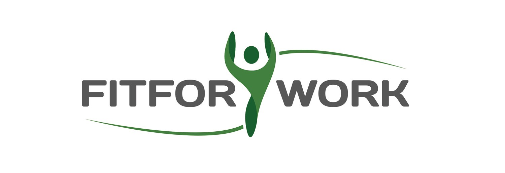

# Fit For Work

[View the live project here.](https://axel713.github.io/fit-for-work/)

Fit For Work I/S offers onsite massage and other well-being therapies to companies in Denmark. This project aims to offer to Fit For Work I/S a visual upgrade to their current website, judged to be lacking in attractivity.

The overall goal is to promote how Fit For Work I/S can help to benefit corporate clients by offering their services to their workforce.

This project was developed in cooperation with the company owners, to gain their input in terms of necessary and future feaatures, as well as design style.

## Content

- [UX](#UX)
  - [User-Stories](#User-Stories)
  - [Wireframes](#Wireframes)
  - [Other-Design-Documents](#Other-Design-Documents)

## UX

Use this section to provide insight into your UX process, focusing on who this website is for, what it is that they want to achieve and how your project is the best way to help them achieve these things.

User profiles are very varied. Whilst they are majorly danish, variations in culture, background, age range and corporate level make it difficult to pinpoint a/some specific groups. Nonetheless, to fit the current scandinavic design trends and the owner's wishes, the new UX must be:

- with a simple and clear layout.
- with a colour theme reflecting professionalism and a "clinical" flavour.

### User Goals

### User Stories

- As a user type, I want to find out why is onsite massage good for my company.
- As a user, I want to find out how can Fit For Work fulfill my own site massage requirements.
- As a user, I want to find out how can Fit For Work make administration of their services easy for me.
- As a user, I want to be able to try the services provided.
- As a user I want to be able to contact Fit for Work I/S.
- As a user, I want to know how does Fit For Work handle the Covid-19 situation.
- As a user, I want to be able to check their social media page.
- As a user, I want a link to Fit For Work booking system.
- As a user, I want to see feedback from other companies using Fit For Work's services.

### Site Owner Goals

### Other Design Documents

_Link pdf files_

### Design Choices

#### Wireframes

_Link pdf files_

#### Fonts

#### Colours

## Features

In this section, you should go over the different parts of your project, and describe each in a sentence or so.

### Existing Features

- Feature 1 - allows users X to achieve Y, by having them fill out Z
- ...

For some/all of your features, you may choose to reference the specific project files that implement them, although this is entirely optional.

In addition, you may also use this section to discuss plans for additional features to be implemented in the future:

### Features Left to Implement

- Another feature idea

## Technologies Used

In this section, you should mention all of the languages, frameworks, libraries, and any other tools that you have used to construct this project. For each, provide its name, a link to its official site and a short sentence of why it was used.

- [JQuery](https://jquery.com)
  - The project uses **JQuery** to simplify DOM manipulation.

## Testing

In this section, you need to convince the assessor that you have conducted enough testing to legitimately believe that the site works well. Essentially, in this part you will want to go over all of your user stories from the UX section and ensure that they all work as intended, with the project providing an easy and straightforward way for the users to achieve their goals.

Whenever it is feasible, prefer to automate your tests, and if you've done so, provide a brief explanation of your approach, link to the test file(s) and explain how to run them.

For any scenarios that have not been automated, test the user stories manually and provide as much detail as is relevant. A particularly useful form for describing your testing process is via scenarios, such as:

1. Contact form:
   1. Go to the "Contact Us" page
   2. Try to submit the empty form and verify that an error message about the required fields appears
   3. Try to submit the form with an invalid email address and verify that a relevant error message appears
   4. Try to submit the form with all inputs valid and verify that a success message appears.

In addition, you should mention in this section how your project looks and works on different browsers and screen sizes.

You should also mention in this section any interesting bugs or problems you discovered during your testing, even if you haven't addressed them yet.

If this section grows too long, you may want to split it off into a separate file and link to it from here.

## Deployment

This section should describe the process you went through to deploy the project to a hosting platform (e.g. GitHub Pages or Heroku).

In particular, you should provide all details of the differences between the deployed version and the development version, if any, including:

- Different values for environment variables (Heroku Config Vars)?
- Different configuration files?
- Separate git branch?

In addition, if it is not obvious, you should also describe how to run your code locally.

## Credits

### Content

- The text for section Y was copied from the [Wikipedia article Z](https://en.wikipedia.org/wiki/Z)

### Media

- The photos used in this site were obtained from ...

### Acknowledgements

- I received inspiration for this project from X
