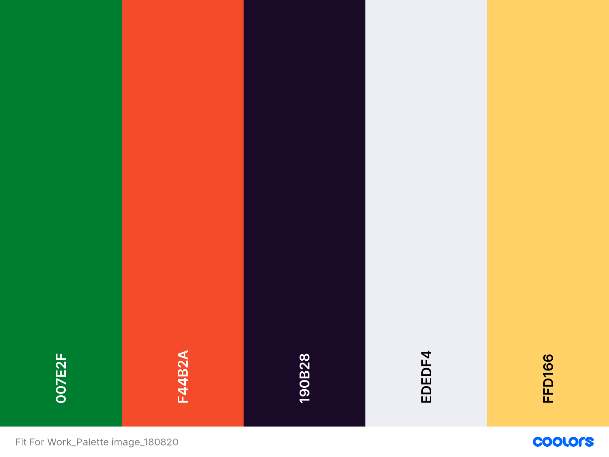
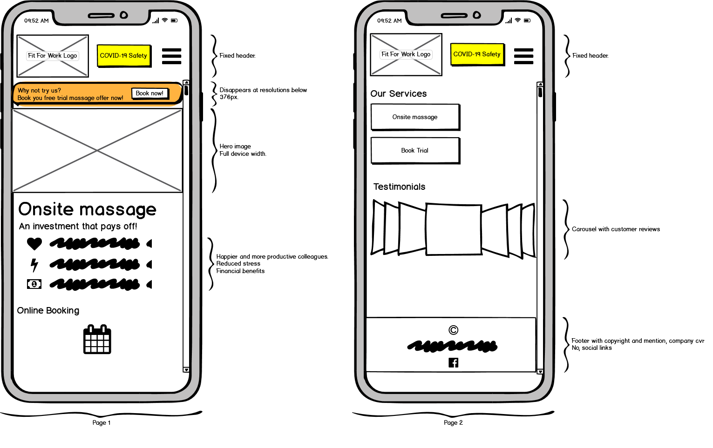
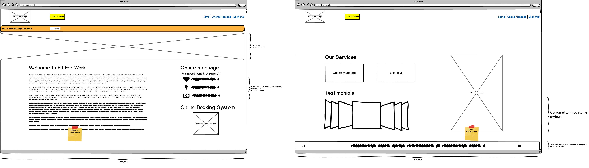
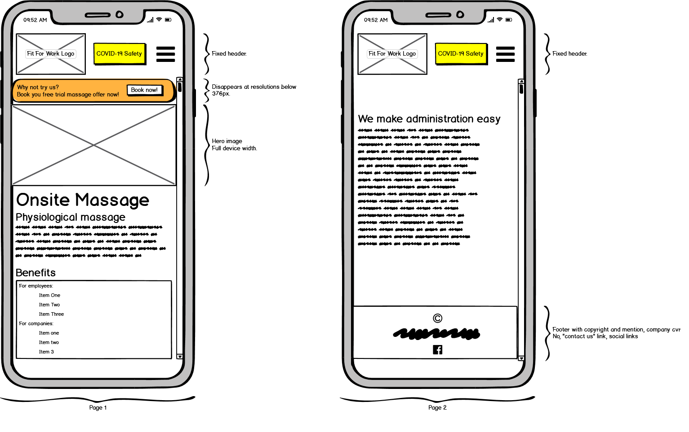
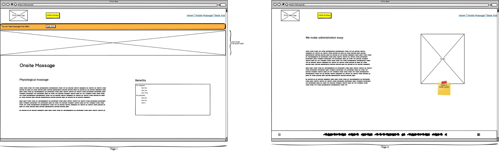
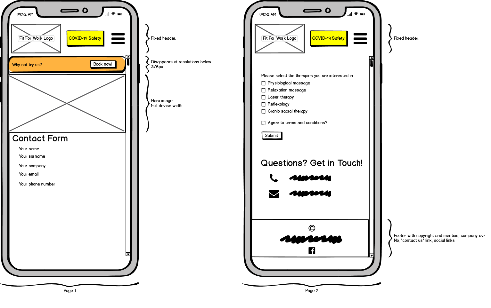
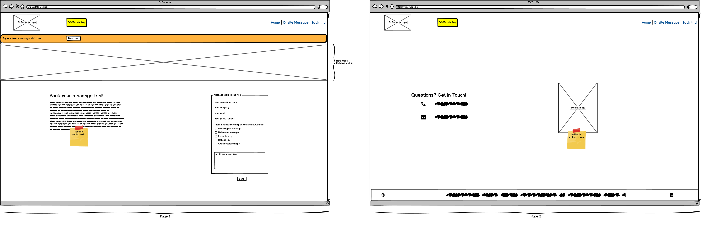

# Fit For Work

[View the live project here.](https://axel713.github.io/fit-for-work/)

Fit For Work I/S offers onsite massage and other well-being therapies to companies in Denmark. This project aims to offer to Fit For Work I/S a visual upgrade to their current website, judged to be lacking in attractivity.

The overall goal is to promote how Fit For Work I/S can help to benefit corporate clients by offering their services to their workforce.

This project was developed in cooperation with the company owners, to gain their input in terms of necessary and future feaatures, as well as design style.

## Content

- [UX](#UX)
  - [User Goals](#User-Goals)
  - [User Stories](#User-Stories)
  - [Site Owner Goals](#Site-Owner-Goals)
  - [User Requirements and Expectations](#User-Requirements-and-Expectations)
  - [Wireframes](#Wireframes)
  - [Other-Design-Documents](#Other-Design-Documents)
  - [Design Choices](#Design-Choices)
    - [Colours](#Colours)
    - [Fonts](#Fonts)
    - [Wireframes](#Wireframes)
- [Features](#Features)
  - [Existing Features](#Existing-Features)
  - [Future Features](#Future-Features)
- [Technologies Used](#Technologies-Used)
- [Testing](#Testing)
  - [HMTL code validation](#HTML-code-validation)
    - [Summary of findings and actions](#Summary-of-findings-and-actions)
  - [CSS code validation](#CSS-code-validation)
  - [Responsiveness](#Responsiveness)
  - [Social media link](#Social-media-link)
  - [Contact Form](#Contact-Form)

## **UX**

User profiles are very varied. Whilst they are majorly danish, variations in culture, background, age range and corporate level make it difficult to pinpoint a/some specific groups. Nonetheless, to fit the current scandinavic design trends and the owner's wishes, the new UX must be:

- with a simple and clear layout.
- with a colour theme reflecting professionalism and a "clinical" flavour.

### **User Goals**

- **Know why** is onsite massage good for my company.
- **Find out** if Fit For Work I/S can fulfill my massage requirements.
- **Know if** Fit For Work I/S helps with administration.
- **Book** a trial session to try Fit For Work I/S's services out.
- **Contact** the site owner.
- **Know how** does Fit For Work I/S handle the Covid-19 situation.
- **Look at** Fit For Work I/S's social media.
- **Access** Fit For Work I/S's booking system.
- **Look at** reviews of Fit For Work I/S.

### **User Stories**

- As a user type, I want to find out why is onsite massage good for my company.
- As a user, I want to find out how can Fit For Work fulfill my own site massage requirements.
- As a user, I want to find out how can Fit For Work make administration of their services easy for me.
- As a user, I want to be able to try the services provided.
- As a user I want to be able to contact Fit for Work I/S.
- As a user, I want to know how does Fit For Work handle the Covid-19 situation.
- As a user, I want to be able to check their social media page.
- As a user, I want a link to Fit For Work booking system.
- As a user, I want to see feedback from other companies using Fit For Work's services.

### **Site Owner Goals**

- As a site owner, I want to inform potential clients about onsite massage benefits.
- As a site owner, I want people to know what actions we take in regards to Covid-19.
- As a site owner, I want prospective customers to easily book a massage trial.
- As a site owner, I want my exisiting customers to have a quick access to out booking system.
- As a site owner, I want users to know how we can help them (onsite massage and easy administration).
- As a site owner, I want users to easily contact me.
- As a site owner, I want users to have a link to our social media page.

### **User Requirements and Expectations**

1. The site must have a navigation bar
1. The site must have a clear and obvious access to information on how we work in regards to Covid-19.
1. The site must include a describition of our services.
1. The site must allow for exisiting and potential customers to easily contact us.
1. The site must include a link to our booking system.
1. The site must include a contact form that collects user details when booking a massage trial.
1. The site must include our contact details.
1. The site must include a link to our social media page.
1. The site must be designed in a visually apppealing manner and easy to read.

### **Design Choices**

The site must be pleasant to the eye whilst using effective colour contrasts to allow objects and sections to stand out from one another. Navigation text and call for action buttons must be large enough to people with dimming vision to browse the site with ease.

#### **Colours**

The selection of colour is made to include Fit For Work Green logo section proeminent. To make the content easy and pleasant to read, I chose a dedicated white (with gray notes) and black (lighter than standard).

- Green #007E2F is used for:
  - navigation (navigation bar and buttons) and header purposes.
  - Icon: bars.
- Orange #F44B2A is used for:
  - navigation bar (current page)
  - image border colour (for images used in a page's content)
  - Name of companies in testimonials
  - "Covid-19 Safety" and "Book Now!" button background
  - Icons: smile, calendar (booking system), phone, mail, file-medical-alt, dumbbell, chart-line, coins, copy, phone-alt, envelope-open-text.
- Black #190B28 is used for text colour.
- White #EDEDF4 is used as pages' background colour.
- Yellow #FFD166 is used for background in callout section (alert bar).

#### **Fonts**

For the navigation bar, I have chosen [Red Rose](https://fonts.google.com/specimen/Red+Rose?query=red).

For the body and footer, I have chosen [Montserrat](https://fonts.google.com/specimen/Montserrat?query=mont).

#### **Wireframes**

This site was designed according to a "mobile first" philosophy, using [balsamiq wireframes](https://balsamiq.com/wireframes/). With it, the basic structure is drawn, as well as changes in layout between mobile and desktop versions.

The current wireframe file (version 04) can be found : [here](design-tools/wireframes/FitForWork_V04.bmpr).

| Mobile Versions                                                                                 | Desktop Versions                                                                                         |
| ----------------------------------------------------------------------------------------------- | -------------------------------------------------------------------------------------------------------- |
|               |               |
|  |  |
|          |          |

Wireframe version historic:

- V01: original version.
- V02: based on feedback from my mentor (Dick Vlaanderen). Reduced number of pages.
- V03: improved the visual attractiveness of the design by giving more breathing space to the different elements.
- V04: (current): updated book-trial page to add contact details and an image to make it more informative and attractive. Upgraded responsive-design between desktop and mobile content: only form and contact details visible in the latter.

[Back to Content](#Content)

---

## **Features**

### **Existing Features**

- Responsive Design

With a _mobile-first_ design principle in mind, the site's layout changes according to the display size, with the most important information shown on mobile-size devices.

- Easy-to-the-eye colour theme

In particular the blend of a white _with gray notes_ and black _with lighter than standard depth_ gives a relaxing reading environment.

- Covid-19 Safety information

A modal pop-up placed in the navgation bar informs users of Fit Fo Work's measures to in regards to Covid-19.

- Contact form

Used to book a massage trial. The form informs the user if they have not completed the mandatory fields of the form, for example: name, email address, etc, and an "Agree to terms and conditions" checkbox. Upon submission of the form, the user gets a notification that the form has been sent and should expect to be contacted by Fit For Work. It must be noted that the current form design is not fully functional (no backend servicing) due to my technology limitations.

- Social link

Located in footer section.

### **Future Features**

- Contact form

To design an implement backend to collect the submited information in a database.

- Additional services

Additional pages that describe further treatment offerings to be implemented.

- Additional languages

An option for the user to choose to to view the site in English or Danish.

[Back to Content](#Content)

---

## **Technologies Used**

### **Languages**

- [HTML](https://developer.mozilla.org/en-US/docs/Web/HTML)
- [CSS](https://developer.mozilla.org/en-US/docs/Web/CSS)
- [JavaScript](https://developer.mozilla.org/en-US/docs/Web/JavaScript)

### **Libraries**

- [Bootstrap](https://getbootstrap.com/)
- [Font-Awesome](https://fontawesome.com/)
- [Google fonts](https://fonts.google.com/)

### **Tools**

- [Git](https://git-scm.com/)
- [GitHub](https://github.com/)
- [Visual Studio Code](https://code.visualstudio.com/)

[Back to Content](#Content)

---

## **Testing**

### **HTML code validation**

To verify the quality of the written HTML documents, I used the automated [W3C Markup Validator](https://validator.w3.org) service. The code was tested with the Direct Input tool.

#### **Summary of findings and actions**

| Page                    | Status                                                                                                               | Actions                                                                                                                                                |
| ----------------------- | -------------------------------------------------------------------------------------------------------------------- | ------------------------------------------------------------------------------------------------------------------------------------------------------ |
| **index.html**          | [Warning](testing/w3c-code-validation/index-html/w3c-code-validation-index-html-r01-110920.pdf)                      | Removed article tags in Welcome to fit For Work section.                                                                                               |
| **index.html**          | [No errors](testing/w3c-code-validation/index-html/w3c-code-validation-index-html-r02-110920.pdf)                    | None.                                                                                                                                                  |
| **onsite-massage.html** | [No errors](testing/w3c-code-validation/onsite-massage-html/w3c-code-validation-onsite-massage-html-r01-110920.pdf)  | None.                                                                                                                                                  |
| **book-trial.html**     | [Warning and Errors](testing/w3c-code-validation/book-trial-html/w3c-code-validation-book-trial-html-r01-110920.pdf) | Removed article tags in Book Your Free Massage Trial section. Changed aria-labelledby="Contact Form sent confirmation" to aria-labelledby="form-sent". |
| **book-trial.html**     | [No errors](testing/w3c-code-validation/book-trial-html/w3c-code-validation-book-trial-html-r02-110920.pdf)          | None.                                                                                                                                                  |

### **CSS code validation**

To verify the quality of the written css document, I used the automated [W3C Markup Validator CSS Validation Service](https://jigsaw.w3.org/css-validator) service. The code was tested with the Direct Input tool.

#### **Summary of findings and actions**

| Page          | Status                                                                                       | Actions                                                                                        |
| ------------- | -------------------------------------------------------------------------------------------- | ---------------------------------------------------------------------------------------------- |
| **style.css** | [Warning and Errors](testing/w3c-code-validation/css/w3c-code-validation-css-r01-110920.pdf) | In .serv-butt, removed border-block-end-width: 1em. In .img-resp-grid-2, removed height: cover |
| **style.css** | [No errors](testing/w3c-code-validation/css/w3c-code-validation-css-r02-110920.pdf)          | None.                                                                                          |

### **Responsiveness**

I tested the site for responsiveness using [Chrome DevTools](https://developers.google.com/web/tools/chrome-devtools), by varying width resolution. I also tested it on an [iPhone XR](https://www.apple.com/uk/shop/buy-iphone/iphone-xr), [Samsung Galaxy S7](https://www.samsung.com/uk/smartphones/galaxy-s7/overview/), [iPad Pro 11](https://www.apple.com/uk/ipad-pro/) and various [Windows](https://www.microsoft.com/en-gb/windows/) based computer with different screen sizes.

It was found to be adequately responsive by myself and some members of the [Code Institute Slack Community](https://code-institute-room.slack.com).

In particular:

- the collapsable navigation bar functions at the designated resolution.
- The correct sections are shown/hidden depending on device sizes.

### **Social media link**

The link located in the footer section functions.

### **Contact Form**

- Tried to submit an empty form and verified that an error message about the required fields appears.
- Tried to submit the form with an invalid email address and verified that a relevant error message appears.
- Tried to submit the form with an invalid phone number (alphabetical characters) and verified that a relevant error message appears.
- Try to submit the form with all inputs valid and verified that a success message appears.

In addition, you should mention in this section how your project looks and works on different browsers and screen sizes.

You should also mention in this section any interesting bugs or problems you discovered during your testing, even if you haven't addressed them yet.

If this section grows too long, you may want to split it off into a separate file and link to it from here.

[Back to Content](#Content)

---

## Deployment

This section should describe the process you went through to deploy the project to a hosting platform (e.g. GitHub Pages or Heroku).

In particular, you should provide all details of the differences between the deployed version and the development version, if any, including:

- Different values for environment variables (Heroku Config Vars)?
- Different configuration files?
- Separate git branch?

In addition, if it is not obvious, you should also describe how to run your code locally.

[Back to Content](#Content)

---

## Credits

### Content

- The text for section Y was copied from the [Wikipedia article Z](https://en.wikipedia.org/wiki/Z)

### Media

- The photos used in this site were obtained from ...

### Acknowledgements

- I received inspiration for this project from X

[Back to Content](#Content)

---
